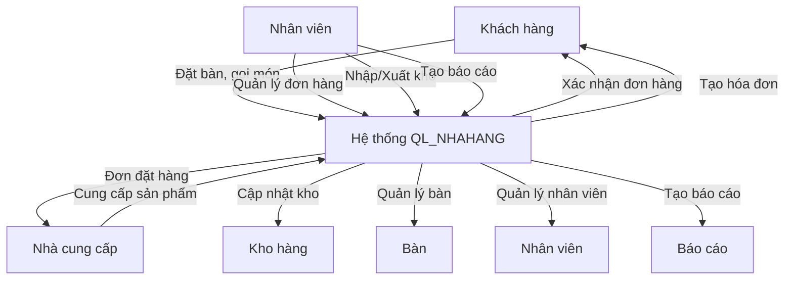

# Quản-lý-Lounge
📁 DAL/ (Quản lý database)

DatabaseHelper.cs
BanDAL.cs
HoaDonDAL.cs
SanPhamDAL.cs
NhanVienDAL.cs
📁 BLL/ (Xử lý nghiệp vụ)

BanBLL.cs
HoaDonBLL.cs
SanPhamBLL.cs
NhanVienBLL.cs
📁 GUI/ (Giao diện)

FormMain.cs
FormBan.cs
FormHoaDon.cs

# Sơ đồ BFD - Hệ thống QL_NHAHANG

## Giới thiệu
Đây là sơ đồ BFD (Business Flow Diagram) mô tả luồng hoạt động của hệ thống quản lý nhà hàng (QL_NHAHANG).

## Sơ đồ BFD

## Hướng dẫn sử dụng
Để xem sơ đồ BFD bằng Markdown, bạn có thể sử dụng các công cụ hỗ trợ Mermaid.js như:
- [Mermaid Live Editor](https://mermaid-js.github.io/mermaid-live-editor/)
- Các trình soạn thảo Markdown có hỗ trợ Mermaid (Visual Studio Code với extension "Markdown Preview Mermaid", GitHub, GitLab...)

## Ghi chú
Sơ đồ này giúp mô tả cách các thành phần trong hệ thống tương tác với nhau, giúp dễ dàng hiểu và phát triển hệ thống hơn.

